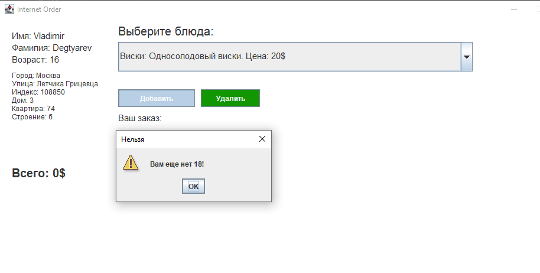

## Программы на JAVA для МИРЭА

### Преподаватель *Литвинов В.В.*

---

#### **Баги и недочеты в задачах**

P.S. Задачи приняты, переделать их можно, но не необходимо

1. **EX7*** - решение на ___GUI___ можно оформить красивее
2. **EX10//Editor** - решение можно исправить на GUI
3. **EX20//Anim** - анимация работает, работает криво (низкий FPS)
4. **EX21** - могут придраться за реализацию класса ***Shape***
5. **EX10, EX13** - это одна и та же задача
6. **EX14-15 EX31-32** - тоже одна задача

---

## Отдельно про задачу 31-32

### Требуется разработать программу для ресторана по указанной UML диаграмме


### GUI разработан на swing, добавлена возможность выбора интернет заказа или заказа "за стол"

#### Окно инициализации пользователя


#### Окно интернет-заказа

Чтобы добавить позицию в заказ, необходимо выбрать ее в выпадающем списке и нажать кнопку добавить. При нажатии
кнопки ***Удалить*** позиция убирается из заказа.

При добавлении и удалении происходит перезапись текста в текстовом поле и изменение заказа в объекте класса ***
InternetOrder***, а так же меняется значение в поле цена.

```java
public class InternetOrderGUI {
	//...
	public void refactorMainOrderTextArea() {
		Item[] currentItems = order.getItems();
		mainOrder.setText("Ваш заказ:\n");
		for (Item item : currentItems) {
			mainOrder.append("\n" + item.toString() + "\n");
		}
		totalCostLabel.setText("Всего: " + order.costTotal() + "$");
	}
}
```


Если вы создадите пользователя, которому нет 18 лет, вы не сможете добавить алкоголь в позицию заказа.

За это отвечает код:

```java
public class InternetOrderGui {
	//...
	public void actionPerformed(ActionEvent e) {
		try {
			Drink drink = (Drink) comboBox.getSelectedItem();
			if (customer.getAge() < 18 && Objects.requireNonNull(drink).isAlcoholicDrink()) {
				JOptionPane.showMessageDialog(null, "Вам еще нет 18!", "Нельзя", JOptionPane.WARNING_MESSAGE);
				return;
			}
		} catch (Exception ex) {}
		order.add((Item) comboBox.getSelectedItem());
		refactorMainOrderTextArea();
	}
}
```
